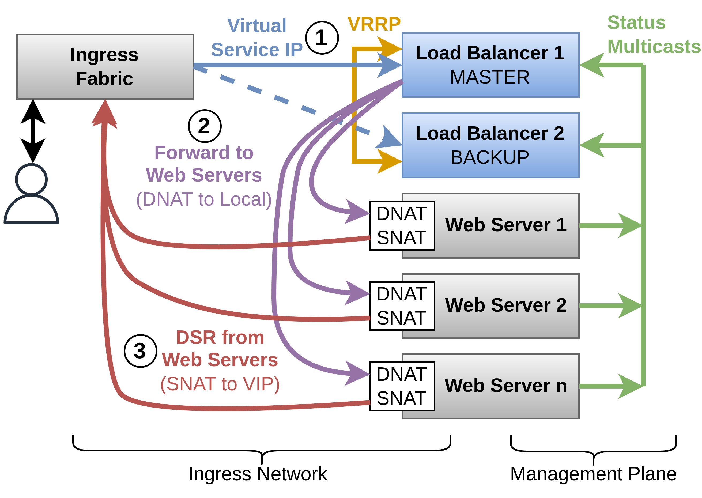

# XDP-based Layer 2.75 Load Balancer

An experiment to gain a hand-on experience with eBPF, XDP and the toolchain ([libbpf](https://github.com/libbpf/libbpf) and [libbpf-bootstrap](https://github.com/libbpf/libbpf-bootstrap)).

XDP based load balancer for IPv4 TCP connections with VRRP for redundancy. 
The connection identification is done via Layer 3/4 details of the packet, the forwarding is handled with Layer 2 rewrites - thus it works somewhere in between.

## How does it work?


- Two load balancer servers are running VRRP and advertise the Virtual Service IP (VIP) to the ingress network for an active-standby-failover.
- Each load balancer runs an eBPF program attached to the ingress network interface. Once traffic is received (1), the program calculates a hash using the 4-tuple (source IP, destination IP, source port, destination port). The hash is used to determine a target web server. A cache is used so that packets from a connection will be routed to the same web server, even if new servers are added during runtime. A userspace software controls the eBPF program (adding/removing servers).
- When a server is selected, its MAC address is obtained from the kernels FIB. The packet is forwarded to the server by rewriting the Ethernet header (2). When TTL of IP header is not decremented, no checksum recalculations are required with this approach. For this forwarding, neither the kernel's network stack nor the userspace is involved, with RSS this is highly efficient.
- On the web server, the destination IP, which is still the VIP is rewritten to a local IP using DNAT and the request is processed.
- The web servers are using Direct Server Return (DSR) (3), the local source IP of the response is rewritten to the VIP using SNAT.
- The web servers are sending health status messages via multicast to both load balancers, allowing them to disable unhealthy targets.

## Testbed

### Dependencies
To execute the testbed, install [Proto²Testbed](https://github.com/martin-ottens/proto2testbed) and prepare a *Debian 12* image as described in README of the tool. The `testbed/testbed.json` config expects the disk image at `/images/debian-12.qcow2`.

For building the software and the testbed setup, additional dependencies are required:
```bash
$ apt install ansible make gcc clang llvm libelf-dev libpcap-dev build-essential libc6-dev-i386 m4 libconfig-dev libbpf-dev libxdp-dev
```

### Build
Clone the submodule and build the eBPF program and loader:
```bash
git submodule update --init
cd bpf
make all -j 4
```

Build the healthcheck program for the web servers:
```bash
cd ../tools
make
```

### Execute the testbed
Start the testbed, the testbed framework will set up up six VMs with the required network topology (ingress network, health check network as well as a management network that allows internet access for the VMs and gives access to all VMs via SSH):
```bash
cd testbed
sudo p2t run -d -i init .
```

In a new terminal, install all VMs using ansible:
```bash
cd ansible
ansible-playbook playbook.yml
```

Connect to the `user` VM to test the system, `10.0.0.200` is the VIP:
```bash
p2t attach -s user
curl 10.0.0.200
```

Repeating the curl command, different web servers should respond:
```txt
root@user:~# curl 10.0.0.200
Site served by node <b>web3</b>
root@user:~# curl 10.0.0.200
Site served by node <b>web1</b>
root@user:~# curl 10.0.0.200
Site served by node <b>web2</b>
```

### Some Additional Tests
- Connect to the active load balancer `lb1` and shut down the VM: The failover to `lb2` is done handled by *keepalived*/VRRP.
- Mark a web server as unhealthy by disabling status reports: Attach to `web{1,2,3}` and run `systemctl stop wd`, the load balancer will disable the server from the selection within 10 seconds. Use `systemctl start wd` to re-enable the web server.


## Limiations
This is just an experiment, so there are some limitations - and ideas:
- Only works with IPv4 and TCP, single VIP and for "one service"
- The load balancers ping all web server in intervals to keep the ARP cache of the kernel up to date. Better: Forward packets to the userspace part (e.g. using `AF_XDP`) when a service IP cannot be resolved to a MAC address using the kernel's FIB. The userspace part could initiate an ARP request on demand and forward the packet.
- Improvement of the lookup function is needed. With optimizations, HTTP/3 / QUIC could also be handeled
